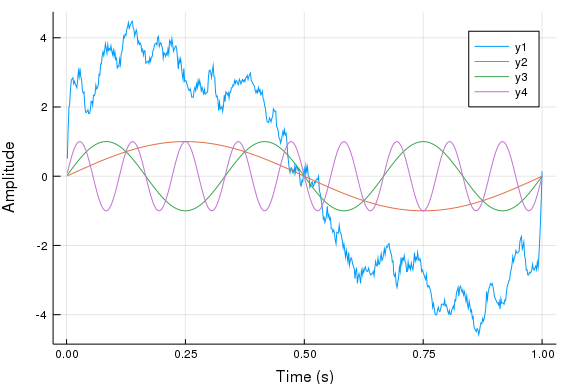
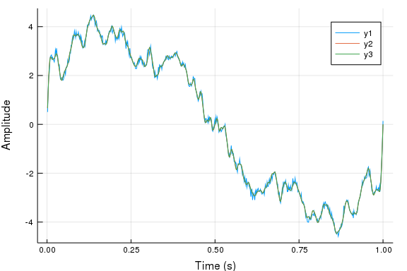

# Introduction


This notebook is parte of the talk on ParameterJuMP.jl in the
third annual JuMP-dev workshop, held in Santiago, Chile, 2019


The main purpose of this notebook is to show an application of
[ParameterJuMP.jl](https://github.com/JuliaStochOpt/ParameterJuMP.jl).
ParameterJuMP is well suited for Benders like decompositions
therefore we shall try to demonstrate the usage of the library
in one of the simplest problems that fits in the Benders
decomposition framework. Norm-1 regression, which is a particular
case of quantile regression is one of such problems.

Note that this is NOT the standard technique to solve Norm-1
regressions. Taylor made methods are available
[here](https://cran.r-project.org/web/packages/quantreg/quantreg.pdf)
for instance.


This notebook will require the following libraries:


ParameterJuMP itself

````julia
using ParameterJuMP
````


JuMP: the julia mathematical programming modeling tool

````julia
using JuMP
````


GLPK: A linear programing solver (other solvers could be used - 
such as Clp, Xpress, Gurobi, CPLEX and so on)


````julia
using Xpress
const OPTIMIZER = Xpress.Optimizer;
````


TimerOutputs: a time measuring library to demonstrate the advantage of using ParameterJuMP

````julia
using TimerOutputs
````


The following two julia default libraries

````julia
using LinearAlgebra # just use the dot function
using Random # to use random number generators
````


Plots library

````julia
using Plots
gr(); # plotting backend
````


# Norm-1 regression


We will apply Norm-1 regression to the
[Linear Regression](https://en.wikipedia.org/wiki/Linear_regression) problem.
Linear regression is a statistical tool to obtain the relation
between one **dependent variable** and other **explanatory variables**.
In other words, given a set of $n$ explanatory variables $X = \{ X_1, \dots, X_n \}$
we would like to obtain the best possible estimate for $Y$.
In order to accomplish such a task we make the hypothesis that $Y$
is aapproximately linear function of $X$:

$Y = \sum_{j =1}^n \beta_j X_j + \varepsilon$

where $\varepsilon$ is some random error.

The estimation of the $\beta$ values relies on observations of the variables:
$\{y^i, x_1^i, \dots, x_n^i\}_i$

In this notebook we will solver a problem where the explanatory variables
are sinusoids of differents frequencies


First, we define the number of explanatory variables and observations


````julia
const N_Candidates = 100
const N_Observations = 600
const N_Nodes = 100

const Observations = 1:N_Observations
const Candidates = 1:N_Candidates
const Nodes = 1:N_Nodes
;
````


Initialize a random number generator to keep results deterministic

````julia
rng = Random.MersenneTwister(123);
````


Building regressors (explanatory) sinusoids

````julia
const X = zeros(N_Candidates, N_Observations)
const time = [obs / N_Observations * 1 for obs in Observations]
for obs in Observations, cand in Candidates
    t = time[obs]
    f = cand
    X[cand, obs] = sin(2 * pi * f * t)
end
````


Define coefficients

````julia
β = zeros(N_Candidates)
for i ∈ Candidates
    if rand(rng) <= (1-i/N_Candidates)^2 && i<=100
        β[i] = 4*rand(rng)/i
    end
end
println("First coefs: $(β[1:min(10, N_Candidates)])")
````


````
First coefs: [3.76206, 0.790906, 0.883406, 0.0521332, 0.0870966, 0.315345, 
0.0, 0.142849, 0.122586, 0.232927]
````


Create noisy observations

````julia
const y = X' * β .+ 0.1*randn(rng, N_Observations)

plt = plot(time, y,
    xlabel = "Time (s)", ylabel = "Amplitude")
plot!(plt, time, X'[:,1])
plot!(plt, time, X'[:,3])
plot!(plt, time, X'[:,9])
````





The classic tool to estimate linear regression models is the 
[Least Squares](https://en.wikipedia.org/wiki/Least_squares) method.

The least squares method relies on solving the optimization problem:

$\max \Bigg\{ \sum_{i \in Observations} \Big( y_i - \sum_{j \in Candidates} \beta_j x_{i,j} \Big) ^2 \Bigg\}$

In Norm-1 regression, the quadratic functions are replaced by absolute values:

$\max\Bigg\{ \sum_{i \in Observations} \Big| y_i - \sum_{j \in Candidates} \beta_j x_{i,j} \Big| \Bigg\}$

This optimization problem can be recast as a [Linear Programming](https://en.wikipedia.org/wiki/Linear_programming) Problem:

$$
\begin{align}
   & \min_{\varepsilon^{up}, \varepsilon^{dw}, \beta}  &&  \sum_{i \in Observations} {\varepsilon^{up}}_i + {\varepsilon^{dw}}_i  && \notag \\
   & \text{subject to}     &&  {\varepsilon^{up}}_i \geq + y_i - \sum_{j \in Candidates} \beta_j x_{i,j} && \forall i \in Observations \notag \\
   &                       &&  {\varepsilon^{dw}}_i \geq - y_i + \sum_{j \in Candidates} \beta_j x_{i,j} && \forall i \in Observations \notag \\
   &                       &&  {\varepsilon^{up}}_i, {\varepsilon^{dw}}_i \geq 0 && \forall i \in Observations \notag \\
\end{align}
$$

Where $Observations$ is the set of all observations.


This linear programming problem can be described in julia with JuMP

````julia
function full_model_regression()
    @time begin # measure time to create a model

        # initialize a optimization model
        full_model = Model(with_optimizer(OPTIMIZER))

        # create optimization variables of the problem
        @variables(full_model, begin
            ɛ_up[Observations] >= 0
            ɛ_dw[Observations] >= 0
            β[1:N_Candidates]
            # 0 <= β[Candidates] <= 8
        end)

        # define constraints of the model
        @constraints(full_model, begin
            ɛ_up_ctr[i in Observations],
                ɛ_up[i] >= + sum(X[j,i] * β[j] for j ∈ Candidates) - y[i]
            ɛ_dw_ctr[i in Observations],
                ɛ_dw[i] >= - sum(X[j,i] * β[j] for j ∈ Candidates) + y[i]
        end)

        # construct the objective function to be minimized
        @objective(full_model, Min, sum(ɛ_up[i] + ɛ_dw[i] for i ∈ Observations))
    end

    # solve the problem
    @time optimize!(full_model)

    # query results of the optimized problem
    @show value.(β)[1:min(10, N_Candidates)]
    @show objective_value(full_model)

    return nothing
end
````


````
full_model_regression (generic function with 1 method)
````


Now we execute the functionthat builds the model and solves it

````julia
N_Observations*N_Candidates < 10_000_000 && full_model_regression()
````


````
0.030339 seconds (60.34 k allocations: 13.307 MiB, 37.11% gc time)
  0.693977 seconds (129.57 k allocations: 13.432 MiB, 0.99% gc time)
value.(β)[1:min(10, N_Candidates)] = [3.76377, 0.790012, 0.878022, 0.056315
5, 0.0876301, 0.314878, 0.00317523, 0.148887, 0.120253, 0.242875]
objective_value(full_model) = 42.62768238530737
````


# Benders decompositon


Benders decompostions is used to solve large optimization problems
with some special characteristics.
LP's can be solved with classical linear optimization methods
such as the Simplex method or Interior point methods provided by
solvers like GLPK.
However, these methods do not scale linearly with the problem size.
In the Benders decomposition framework we break the problem in two pieces:
A master and a slave problem.

Of course some variables will belong to both problems, this is where the
cleverness of Benders kicks in:
The master problem is solved and passes the shared variables to the slave.
The slave problem is solved with the shared variables FIXED to the values
given by the master problem. The solution of the slave problem can be used
to generate a constraint to the master problem to describe the linear
approximation of the cost function of the shared variables.
In many cases, like stochastic programming, the slave problems have a
interestig structure and might be broken in smaller problem to be solved
in parallel.


We will descibe the decomposition similarly to what is done in:
Introduction to Linear Optimization, Bertsimas & Tsitsiklis (Chapter 6.5):
Where the problem in question has the form

$$
\begin{align}
   & \min_{x, y_k}     &&  c^T x && + f_1^T y_1 && + \dots && + f_n^T y_n  &&  \notag \\
   & \text{subject to} &&  Ax    &&             &&         &&              && = b \notag \\
   &                   &&  B_1 x && + D_1 y_1   &&         &&              && = d_1 \notag \\
   &                   &&  \dots &&             &&  \dots  &&              &&       \notag \\
   &                   &&  B_n x &&             &&         && + D_n y_n    && = d_n \notag \\
   &                   &&   x,   &&     y_1,    &&         &&       y_n    && \geq 0 \notag \\
\end{align}
$$


### Slave


Given a solution for the $x$ variables we can define the slave problem as


$$
\begin{align}
z_k(x) \ = \ & \min_{y_k}        &&  f_k^T y_k &&                  \notag \\
             & \text{subject to} &&  D_k y_k   &&  = d_k - B_k x \notag \\
             &                   &&  y_k       && \geq 0          \notag \\
\end{align}
$$


The $z_k(x)$ function represents the cost of the subproblem given a
solution for $x$. This function is a convex function because $x$
affects only the right hand side of the problem (this is a standard
resutls in LP theory).

For the special case of the Norm-1 reggression the problem is written as:

$$
\begin{align}
z_k(\beta) \ = \ & \min_{\varepsilon^{up}, \varepsilon^{dw}}         &&  \sum_{i \in ObsSet(k)} {\varepsilon^{up}}_i + {\varepsilon^{dw}}_i               && \notag \\
                 & \text{subject to}     &&  {\varepsilon^{up}}_i \geq + y_i - \sum_{j \in Candidates} \beta_j x_{i,j} && \forall i \in ObsSet(k) \notag \\
                 &                       &&  {\varepsilon^{dw}}_i \geq - y_i + \sum_{j \in Candidates} \beta_j x_{i,j} && \forall i \in ObsSet(k) \notag \\
                 &                       &&  {\varepsilon^{up}}_i, {\varepsilon^{dw}}_i \geq 0                             && \forall i \in ObsSet(k) \notag \\
\end{align}
$$

The collection $ObsSet(k)$ is a sub-set of the N_Observations.
Any partition of the N_Observations collection is valid.
In this notebook we will parition with the function:

````julia
function ObsSet(K)
    obs_per_block = div(N_Observations, N_Nodes)
    return (1 + (K - 1) * obs_per_block):(K * obs_per_block)
end
````


````
ObsSet (generic function with 1 method)
````


Which can be written in JuMP as follows.

At this point we make a small detour to highlight the ParameterJuMP
application. Every time you a find a IF block with the flag `PARAM`
it means that we have two different implmentatins of the method:
one relying on ParameterJuMP and the other using pure JuMP.


````julia
function slave_model(PARAM, K)

    # initialize the JuMP model
    slave = if PARAM
        # special constructor exported by ParameterJuMP
        # to add the functionality to the model
        ModelWithParams(with_optimizer(OPTIMIZER))
    else
        # regular JuMP constructor
        Model(with_optimizer(OPTIMIZER))
    end

    # Define local optimization variables for norm-1 error
    @variables(slave, begin
        ɛ_up[ObsSet(K)] >= 0
        ɛ_dw[ObsSet(K)] >= 0
    end)

    # create the regression coefficient representation
    if PARAM
        # here is the main constructor of the Parameter JuMP packages
        # it will create model *parameters* instead of variables
        # variables are added to the optimization model, while parameters
        # are not. Parameters are merged with LP problem constants and do not
        # increase the model dimensions.
        β = Parameters(slave, zeros(N_Candidates))
    else
        # Create fixed variables
        @variables(slave, begin
            β[Candidates]
            β_fixed[1:N_Candidates] == 0
        end)
        @constraint(slave, β_fix[i in Candidates], β[i] == β_fixed[i])
    end

    # create local constraints
    # note that *parameter* algebra is implemented just like variables
    # algebra. We can multiply parameters by constants, add parameters,
    # sum parameters and varaibles and so on.
    @constraints(slave, begin
        ɛ_up_ctr[i in ObsSet(K)],
            ɛ_up[i] >= + sum(X[j,i] * β[j] for j ∈ Candidates) - y[i]
        ɛ_dw_ctr[i in ObsSet(K)],
            ɛ_dw[i] >= - sum(X[j,i] * β[j] for j ∈ Candidates) + y[i]
    end)
    # ATTENTION β[j] * X[j,i] Is much slower

    # create local objective function
    @objective(slave, Min, sum(ɛ_up[i] + ɛ_dw[i] for i ∈ ObsSet(K)))

    # return the correct group of parameters
    if PARAM
        return (slave, β)#β_upper, β_lower)
    else
        return (slave, β, β_fixed, β_fix)#β_upper, β_lower)
    end
end
````


````
slave_model (generic function with 1 method)
````


### Master


Now that all pieces of the original problem can be representad by
the convex $z_k(x)$ functions we can recast the problem inthe the equivalent form:

$$
\begin{align}
 & \min_{x}          &&  c^T x + z_1(x) + \dots + z_n(x) && \notag \\
 & \text{subject to} &&  Ax = b                          && \notag \\
 &                   &&  x \geq 0                        && \notag \\
\end{align}
$$

However we cannot pass a problem in this for to a linear programming
solver (it could be passed to other kinds of solvers).

Another standart result of optimization theory is that a convex function
an be represented by its supporting hyper-planes:

$$
\begin{align}
 z_k(x) \ = \ & \min_{z, x}       &&  z && \notag \\
              & \text{subject to} &&  z \geq \pi_k(\hat{x}) (x - \hat{x}) + z_k(\hat{x}), \ \forall \hat{x} \in dom(z_k) && \notag \\
\end{align}
$$

Then we can re-write (again) the master problem as

$$
\begin{align}
 & \min_{x, z_k}     &&  c^T x + z_1 + \dots + z_n \notag \\
 & \text{subject to} &&  z_i \geq \pi_i(\hat{x}) (x - \hat{x}) + z_i(\hat{x}), \ \forall \hat{x} \in dom(z_i), i \in \{1, \dots, n\} \notag \\
 &                   &&  Ax = b \notag \\
 &                   &&  x \geq 0 \notag \\
\end{align}
$$

Which is a linear program!

However, it has infinitely many constraints !!!

We can relax thhe infinite constraints and write:

$$
\begin{align}
 & \min_{x, z_k}     &&  c^T x + z_1 + \dots + z_n \notag \\
 & \text{subject to} &&  Ax = b \notag \\
 &                   &&  x \geq 0 \notag \\
\end{align}
$$

But now its only an underestimated problem.
In the case of our problem it can be written as:

It is possible to rewrite the above problem 

$$
\begin{align}
 & \min_{\varepsilon, \beta} &&  \sum_{i \in Nodes} \varepsilon_i \notag \\
 & \text{subject to} &&  \varepsilon_i \geq 0 \notag \\
\end{align}
$$

This model can be written in JUMP


````julia
function master_model(PARAM)
    master = Model(with_optimizer(OPTIMIZER))
    @variables(master, begin
        ɛ[Nodes] >= 0
        β[1:N_Candidates]
        # 0 <= β[Candidates] <= 8
    end)
    @objective(master, Min, sum(ɛ[i] for i ∈ Nodes))
    sol = zeros(N_Candidates)
    return (master, ɛ, β, sol)
end
````


````
master_model (generic function with 1 method)
````


The method to solve the master problem and query its solution
is given here:

````julia
function master_solve(PARAM, master_model)
    model = master_model[1]
    β = master_model[3]
    optimize!(model)
    return (value.(β), objective_value(model))
end
````


````
master_solve (generic function with 1 method)
````


### Supporting Hyperplanes


With these building blocks in hand, we can start building the algorithm.

So far we know how to:
- Solve the relaxed master problem
- Obtain the solution for the $\hat{x}$ (or $\beta$ in our case)


Now we can:
- Fix the values of $\hat{x}$ in the slave problems
- Solve the slave problem
- query the solution of the slave problem to obtain the supporting hyperplane

the value of $z_k(\hat{x})$, which is the objectie value of the slave problem

and the derivative $\pi_k(\hat{x}) = \frac{d z_k(x)}{d x} \Big|_{x = \hat{x}}$
the derivative is the dual variable associated to the variable $\hat{x}$,
which results by applying the chain rule on the constraints duals.

These new steps are executed by the function:

````julia
function slave_solve(PARAM, model, master_solution)
    β0 = master_solution[1]
    slave = model[1]

    # The first step is to fix the values given by the master problem
    @timeit "fix" if PARAM
        # *parameters* can be set to new values and the optimization
        # model will be automatically updated
        β = model[2]
        ParameterJuMP.setvalue!.(β, β0)
    else
        # JuMP also has the hability to fix variables to new values
        β_fixed = model[3]
        β_fix = model[4]
        fix.(β_fixed, β0)
    end

    # here the slave problem is solved
    @timeit "opt" optimize!(slave)

    # query dual variables, which are sensitivities
    # they represent the subgradient (almost a derivative)
    # of the objective function for infinitesimal variations
    # of the constants in the linear constraints
    @timeit "dual" if PARAM
        # we can query dual values of *parameters*
        π = dual.(β)
    else
        # or, in pure JuMP, we query the duals form
        # constraints tha fix the values of our regression
        # coefficients
        π = dual.(β_fix)
    end

    # π2 = shadow_price.(β_fix)
    # @show sum(π .- π2)
    obj = objective_value(slave)
    rhs = obj - dot(π, β0)
    return (rhs, π, obj)
end
````


````
slave_solve (generic function with 1 method)
````


Now that we have cutting plane in hand we can add them to the master problem:


````julia
function master_add_cut(PARAM, master_model, cut_info, node)
    master = master_model[1]
    ɛ = master_model[2]
    β = master_model[3]

    rhs = cut_info[1]
    π = cut_info[2]

    @constraint(master,
        ɛ[node] >= sum(π[j] * β[j] for j ∈ Candidates) + rhs)
end
````


````
master_add_cut (generic function with 1 method)
````


### Algorithm wrap up


The complete algorithm is


- Solve the relaxed master problem
- Obtain the solution for the $\hat{x}$ (or $\beta$ in our case)
- Fix the values of $\hat{x}$ in the slave problems
- Solve the slave problem
- query the solution of the slave problem to obtiain the supporting hyperplane
- add hyperplane to master problem
- repeat


Now we grab all the pieces tha we built and we writeh the benders
algorithm by calling the above function in a proper order.

The macros `@timeit` are use to time each step of the algorithm.

````julia
function decomposed_model(PARAM)
    reset_timer!() # reset timer fo comparision
    @timeit "Init" begin
        println("Initialize decomposed model")

        # Create the mastter problem with no cuts
        println("Build master problem")
        @timeit "Master" master = master_model(PARAM)

        # initialize solution for the regression coefficients in zero
        println("Build initial solution")
        @timeit "Sol" solution = (zeros(N_Candidates), Inf)
        best_sol = deepcopy(solution)

        # Create the slave problems
        println("Build slave problems")
        @timeit "Slaves" slaves = [slave_model(PARAM, i) for i ∈ Candidates]

        # Save initial version of the slave problems and create
        # the first set of cuts
        println("Build initial cuts")
        @timeit "Cuts" cuts = [slave_solve(PARAM, slaves[i], solution) for i ∈ Candidates]
    end

    UB = +Inf
    LB = -Inf

    println("Initialize Iterative step")
    @time @timeit "Loop"  for k in 1:80

        # Add cuts generated from each slave problem to the master problem
        @timeit "add cuts" for i ∈ Candidates
            master_add_cut(PARAM, master, cuts[i], i)
        end

        # Solve the master problem with the new set of cuts
        # obtain new solution candidate for the regression coefficients
        @timeit "solve master" solution = master_solve(PARAM, master)

        # Pass the new candidate solution to each of the slave problems
        # Solve the slave problems and obtain cuttin planes
        # @show solution[2]
        @timeit "solve nodes" for i ∈ Candidates
            cuts[i] = slave_solve(PARAM, slaves[i], solution)
        end

        LB = solution[2]
        new_UB = sum(cuts[i][3] for i ∈ Candidates)
        if new_UB <= UB
            best_sol = deepcopy(solution)
        end
        UB = min(UB, new_UB)
        @show k, LB, UB

        if abs(UB - LB)/(abs(UB)+abs(LB)) < 0.05
            println("Converged!")
            break
        end
    end
    @show solution[1][1:min(10, N_Candidates)]
    @show solution[2]

    print_timer()

    return best_sol[1]
end
````


````
decomposed_model (generic function with 1 method)
````


Run benders decomposition with pure JuMP

````julia
GC.gc()
β1 = decomposed_model(false);
````


````
Initialize decomposed model
Build master problem
Build initial solution
Build slave problems
Build initial cuts
Initialize Iterative step
(k, LB, UB) = (1, 0.0, 736.9397549915154)
(k, LB, UB) = (2, 0.0, 736.9397549915154)
(k, LB, UB) = (3, 16.349215016228914, 91.35425023118906)
(k, LB, UB) = (4, 28.27109871462413, 55.078259122158684)
(k, LB, UB) = (5, 36.35333651603361, 50.10700424349081)
(k, LB, UB) = (6, 40.587767838387414, 45.263955986446454)
(k, LB, UB) = (7, 42.040356808876794, 44.03470247234688)
Converged!
  1.224445 seconds (2.51 M allocations: 114.380 MiB, 4.61% gc time)
(solution[1])[1:min(10, N_Candidates)] = [3.76267, 0.792786, 0.873536, 0.05
58342, 0.0914146, 0.312128, -0.00148945, 0.155308, 0.121462, 0.236182]
solution[2] = 42.040356808876794
 ─────────────────────────────────────────────────────────────────────────
                                  Time                   Allocations      
                          ──────────────────────   ───────────────────────
     Tot / % measured:         1.91s / 100%             261MiB / 100%     

 Section          ncalls     time   %tot     avg     alloc   %tot      avg
 ─────────────────────────────────────────────────────────────────────────
 Loop                  1    1.22s  64.2%   1.22s    114MiB  43.8%   114MiB
   solve nodes         7    838ms  43.9%   120ms   96.6MiB  37.0%  13.8MiB
     opt             700    512ms  26.8%   731μs   2.49MiB  0.95%  3.64KiB
     fix             700    195ms  10.2%   278μs   73.8MiB  28.3%   108KiB
     dual            700    123ms  6.43%   175μs   20.0MiB  7.66%  29.3KiB
   solve master        7    278ms  14.6%  39.7ms   1.55MiB  0.60%   227KiB
   add cuts            7   80.9ms  4.24%  11.6ms   14.7MiB  5.63%  2.10MiB
 Init                  1    682ms  35.8%   682ms    147MiB  56.2%   147MiB
   Cuts                1    531ms  27.8%   531ms    101MiB  38.9%   101MiB
     opt             100    411ms  21.6%  4.11ms   93.3MiB  35.7%   955KiB
     dual            100   28.9ms  1.51%   289μs   2.86MiB  1.09%  29.3KiB
     fix             100   1.65ms  0.09%  16.5μs    633KiB  0.24%  6.33KiB
   Slaves              1    150ms  7.86%   150ms   44.9MiB  17.2%  44.9MiB
   Master              1    533μs  0.03%   533μs    148KiB  0.06%   148KiB
   Sol                 1    428ns  0.00%   428ns      928B  0.00%     928B
 ─────────────────────────────────────────────────────────────────────────
````


Run benders decomposition with ParameterJuMP

````julia
GC.gc()
β2 = decomposed_model(true);
````


````
Initialize decomposed model
Build master problem
Build initial solution
Build slave problems
Build initial cuts
Initialize Iterative step
(k, LB, UB) = (1, 0.0, 736.9397549915209)
(k, LB, UB) = (2, 0.0, 736.9397549915209)
(k, LB, UB) = (3, 16.349215016228925, 91.35425023118788)
(k, LB, UB) = (4, 28.27109871462454, 55.07825912215957)
(k, LB, UB) = (5, 36.35333651603328, 50.107004243490096)
(k, LB, UB) = (6, 40.58776783838726, 45.26395598644719)
(k, LB, UB) = (7, 42.04035680887688, 44.03470247234724)
Converged!
  0.696605 seconds (416.20 k allocations: 26.329 MiB, 2.43% gc time)
(solution[1])[1:min(10, N_Candidates)] = [3.76267, 0.792786, 0.873536, 0.05
58342, 0.0914146, 0.312128, -0.00148945, 0.155308, 0.121462, 0.236182]
solution[2] = 42.04035680887688
 ─────────────────────────────────────────────────────────────────────────
                                  Time                   Allocations      
                          ──────────────────────   ───────────────────────
     Tot / % measured:         1.02s / 100%            64.6MiB / 100%     

 Section          ncalls     time   %tot     avg     alloc   %tot      avg
 ─────────────────────────────────────────────────────────────────────────
 Loop                  1    697ms  68.1%   697ms   26.3MiB  40.8%  26.3MiB
   solve nodes         7    361ms  35.3%  51.5ms   10.4MiB  16.1%  1.49MiB
     opt             700    340ms  33.3%   486μs   8.34MiB  12.9%  12.2KiB
     dual            700   10.5ms  1.03%  15.1μs   1.09MiB  1.69%  1.59KiB
     fix             700   3.47ms  0.34%  4.96μs    613KiB  0.93%     896B
   solve master        7    278ms  27.2%  39.7ms   1.55MiB  2.40%   227KiB
   add cuts            7   56.2ms  5.49%  8.02ms   14.3MiB  22.2%  2.05MiB
 Init                  1    327ms  31.9%   327ms   38.3MiB  59.2%  38.3MiB
   Cuts                1    242ms  23.6%   242ms   17.4MiB  26.9%  17.4MiB
     opt             100    135ms  13.2%  1.35ms   11.4MiB  17.7%   117KiB
     dual            100   2.53ms  0.25%  25.3μs    159KiB  0.24%  1.59KiB
     fix             100    463μs  0.05%  4.63μs   87.5KiB  0.13%     896B
   Slaves              1   83.0ms  8.11%  83.0ms   20.7MiB  32.1%  20.7MiB
   Master              1   1.28ms  0.13%  1.28ms    148KiB  0.22%   148KiB
   Sol                 1    428ns  0.00%   428ns      928B  0.00%     928B
 ─────────────────────────────────────────────────────────────────────────
````


Plot resulting time series from the benders base estimations

````julia
const y1 = X' * β1
const y2 = X' * β2

plt = plot(time, y,
    xlabel = "Time (s)", ylabel = "Amplitude")
plot!(plt, time, y1)
plot!(plt, time, y2)
````





# Acknowledgments


ParameterJuMP was developed by Joaquim Dias Garcia (@joaquimg) and Benoît Legat (@blegat)

